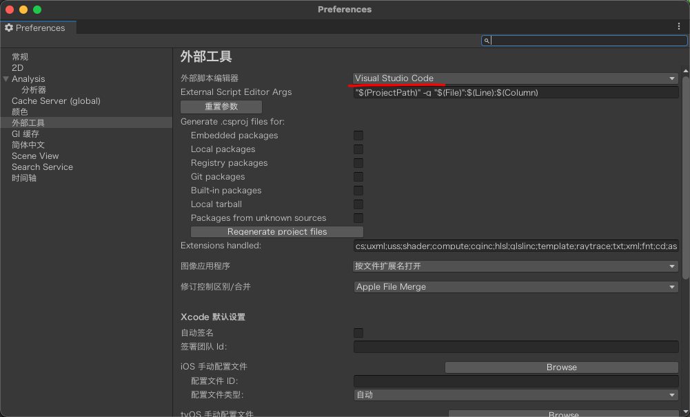
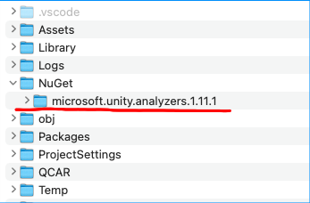

# VSCode 代码自动提示

## 安装 SDK

- [下载 .NET SDK](https://dotnet.microsoft.com/download)
- [下载 .NET Framework 4.7.1 Developer Pack (Windows Only)](https://dotnet.microsoft.com/download/dotnet-framework/net471)
- [下载 Mono (macOS Only)](https://www.mono-project.com/download/stable/)
- `(非必需步骤)` [下载 Microsoft.Unity.Analyzers](https://www.nuget.org/packages/Microsoft.Unity.Analyzers/)，解压缩，备用

## Unity 设置

- Windows: 菜单 > Unity > 首选项 > External Tools
- macOS: 菜单 > Edit > Preferences > External Tools
- External Script Editor > 选中 Visual Studio Code



## VSCode 插件

- C#
  - 配置项 omnisharp.useGlobalMono: always
- (可选) Debugger for Unity
- (可选) Unity Code Snippets
- (可选) Unity Tools

注意：安装插件后，使用 VSCode 第一次打开项目会自动下载一些包

## 项目配置 `(非必需步骤)`

1. 项目根目录创建 .editorconfig 文件

```conf
root=true

[*.cs]
dotnet_diagnostic.IDE0051.severity = none
```

2. 在根目录创建 `NuGet` 文件夹，将之前下载的 microsoft.unity.analyzers.XXX.nupkg 解压缩到该文件夹。`XXX 是你下载的版本号`



3. 项目根目录创建 omnisharp.json 文件

```json
{
  "RoslynExtensionsOptions": {
    "EnableAnalyzersSupport": true,
    "LocationPaths": ["./NuGet/microsoft.unity.analyzers.XXX"]
  }
}
```

## 完成

关闭 VSCode 和 Unity 并重新启动

## 参考资料

- [Unity Development with VS Code](https://code.visualstudio.com/docs/other/unity)
