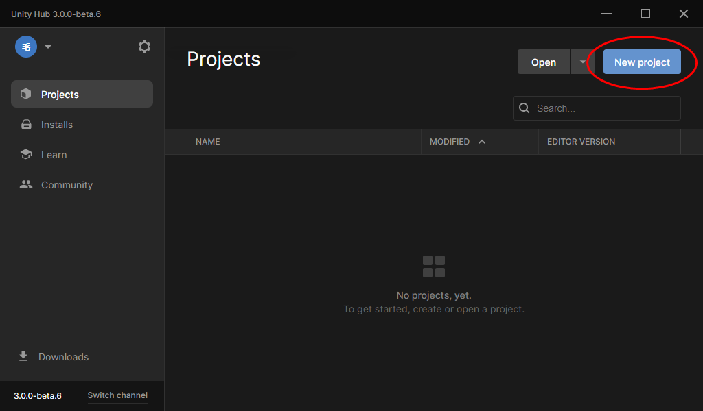
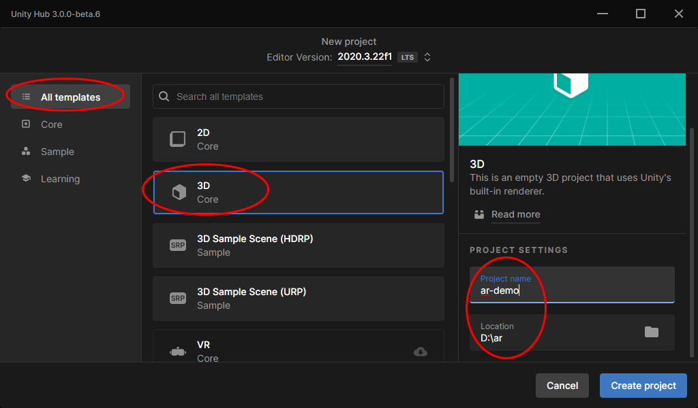
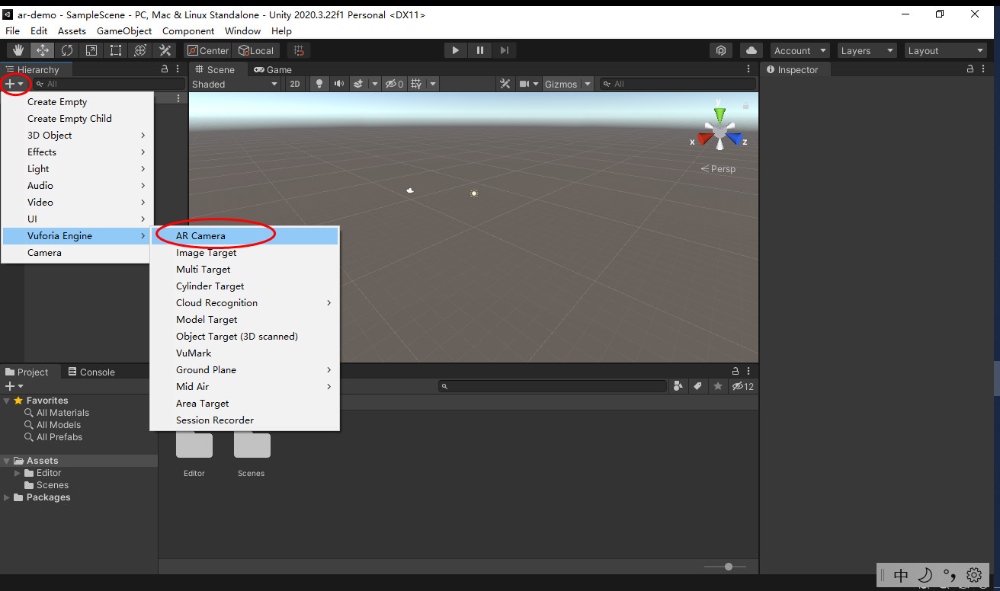
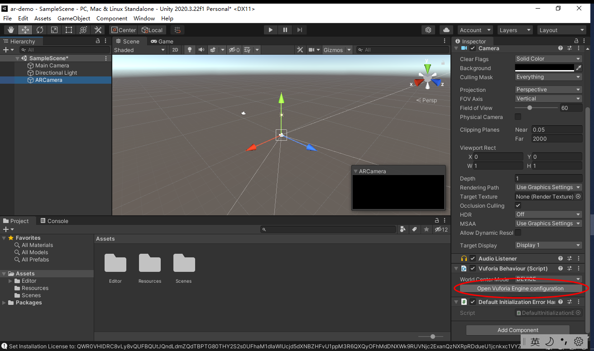
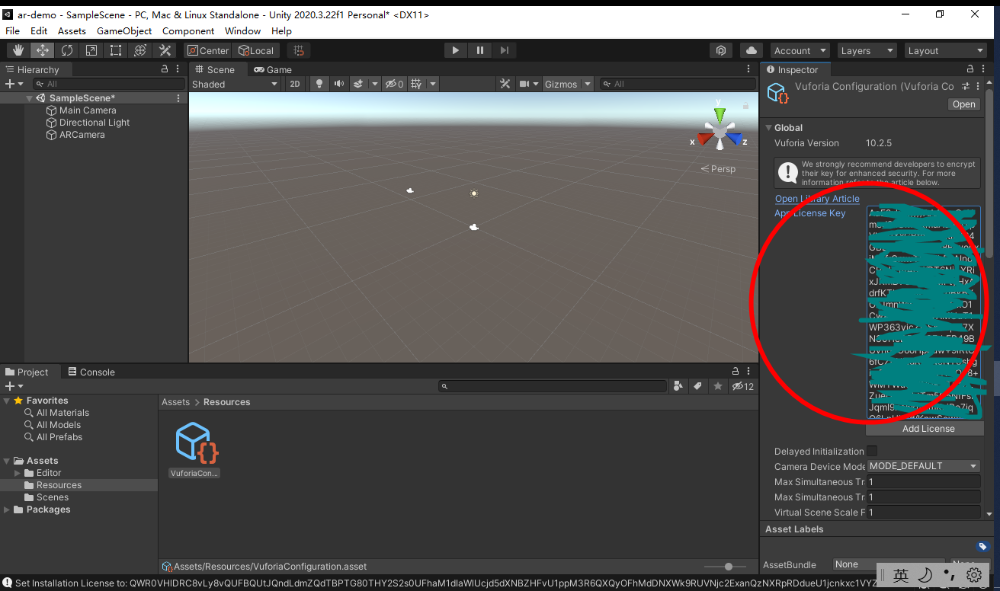

# Vuforia Engine 安装

1. [注册/登录 Vuforia 开发账号](https://developer.vuforia.com/vui/auth/register)
2. [下载 Vuforia Engine 的 Unity package](https://developer.vuforia.com/downloads/sdk)，备用，建议 `10.2` 版
3. 进入 Vuforia 的 [License Manager](https://developer.vuforia.com/vui/develop/licenses)，点击 `Get Development Key` 申请一个开发者授权，备用
3. 新建并打开 Unity 项目

4. 点击编辑器菜单的 Assets > Import Package > Custom Package，导入第 2 步下载的 `.unitypackage` 文件

5. 如果出现 Add Vuforia Engine Package 对话框，点击 `Update` 按钮即可。
6. 添加 ARCamera 并选中，点击右侧窗口中的 `Open Vuforia Engine configuration`

7. 输入第 3 步申请的 `License key`

8. 删除 Main Camera

参考资料：

- [Vuforia Engine Package for Unity](https://library.vuforia.com/getting-started/vuforia-engine-package-unity)
- [Add a License Key to Your Vuforia Engine App](https://library.vuforia.com/getting-started/add-license-key-your-vuforia-engine-app)